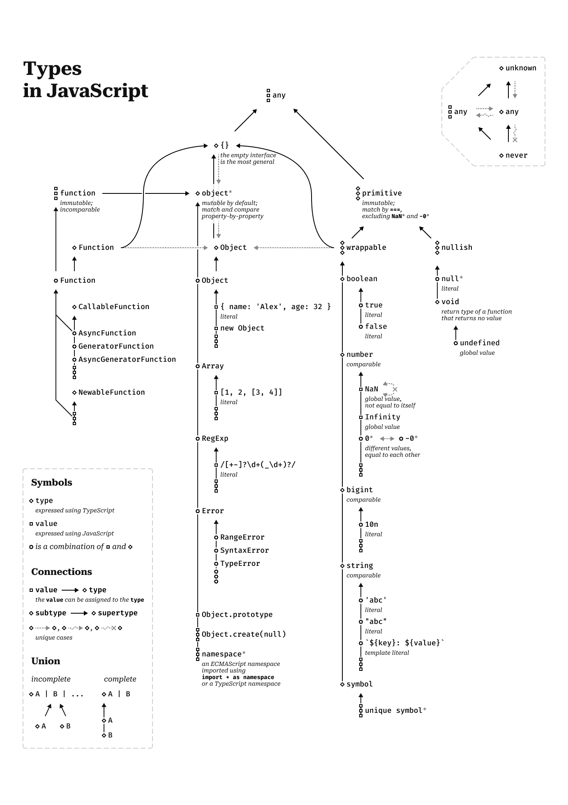

# JavaScript Type System Schema

The definitive schema of the JavaScript type system. Get an overview of the entire system and explore its oddities all at once.

## Goal and Principles

The goal is to document the JavaScript type system in full detail.

Principles:

- Follow the ECMAScript specification.
- Use TypeScript to specify most details.
- Use additional locally defined concepts to specify the remaining details.
- Keep the schema consistent and comprehensive.

## Sources

The schema was made entirely in Figma: [the source Figma-file](https://www.figma.com/design/Hyk4t6fvOsUG2L5mMtYH9O/js-type-system-schema?node-id=0-1).

## Live Demo

[Live Demo as a Figma Prototype](https://www.figma.com/proto/Hyk4t6fvOsUG2L5mMtYH9O/js-type-system-schema?node-id=6086-151754&t=HLJdcdC9Oj7n5uag-0&scaling=scale-down-width&content-scaling=fixed&starting-point-node-id=6086%3A151754&hide-ui=1)

## Printable Schema

An example of how the schema might look in print on a paper A4 sheet. Note that the presented image is not actually prepared for printing.

